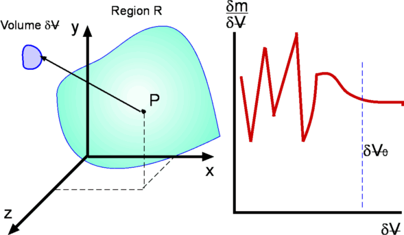
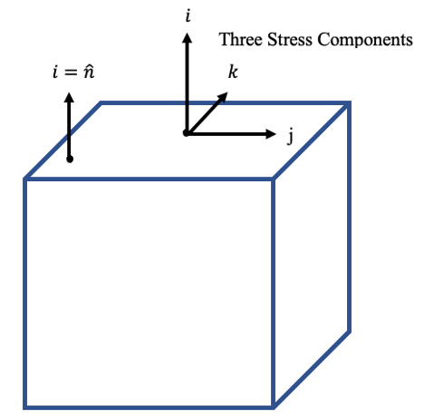
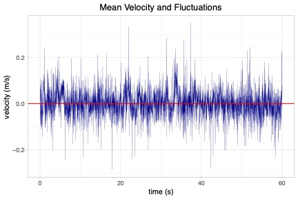

**ENVI 580: Fluid Mechanics**  
**Duquesne University**  

```{r include=FALSE}
library(ggplot2)
library(raster)
library(rgdal)
library(dplyr)
library(broom)
```

## Introduction
I'll always remember what I was told on the first day of my fluid mechanics class.  The professor said, "fluid mechanics is fun and it is all around us."  What I didn't realize was how true it was.  With fluid mechanics, you will start to recognized elements in the world in a new way.  You will see how fluids shape our world.  

So, what is a fluid?  
> A fluid is a material that deforms continuously under any shear stress.  

How do we "do" fluid mechanics?  In engineering fluid mechanics, we consider fluids as a continuum.  Specifically, our calculations are limited to the segment of the continuum where the fluid properties are approximately equal at multiple scales.  To illustrate this concept, let's consider density at the scale of the mean free path (the average distance between molecules in a material).  If we measure the density in one spot, we might indeed measure zero!  If we expand slightly and include a molecule, we get a dramatically different measurement.  These measurements may change rapidly and severely in these small scales.  Eventually, we reach a point where the property, in this case, density, evens out and represents the material.  Similarly, eventually, our scale may become so large, that we cannot ensure that we are only measuring the material of interest.  Don't worry, this still gives us plenty of work to do fluid mechanics (Figure 1).



So, what is a shear stress?  

  

### Dimensions
Dimensions refer to the type of measurement.  This is in contrast to units, which are specific quantities of dimensions; frequently, we use dimensions and fundamental units (not derived units) to refer to the same concept.  Use caution here: this will work for length or time, but force and mass are not independent; therefore, whether you use dimensions or units, you must be careful with derived units.  

#### Dimensional Equations  
Sometimes, equations are developed for a specific set of units as opposed to any consistent set of units.  If any consistent set of units will work, it has homogeneous dimensions.  If specific units must be used, it is dimensional.  If an equation has homogeneous dimensions, we can compute the dimensions on both sides of the equation and they will be equal (or zero, if you cancel everything out).  

As an example, consider the equation:  
\begin{equation}
Q = 0.61 A \sqrt{2 g h}
\end{equation}  

where $Q$ is the volumetric flow rate, $A$ is the cross-sectional area, $g$ is the acceleration due to gravity, and $h$ is height.  If we plug in the dimensions to the equation, we get:  
\begin{equation}
\frac{L^3}{T} = 0.61 L^2 (2 \frac{L}{T^2} L)^{\frac{1}{2}}
\end{equation}

Since the constants have no units, they are removed, which reduces to:  
\begin{equation}
\frac{L^3}{T} = \frac{L^3}{T}
\end{equation}

This equation is dimensionally consistent or homogeneous.

#### Dimensionless Numbers  
Dimensional analysis is a powerful tool in understanding relationships.  We will do more dimensional analysis and the mathematical theorem that supports it later, but it is useful to take a look at one relationship now because it will shape how we examine certain problems.  We are about to work on viscosity and shear stress, but these concepts will first be developed for laminar flow.  Laminar flow is a flow where inertial forces are the same magnitude or lower than the viscous forces.  To compare these, we compare density $\rho$, velocity $U$, length scale $L$, and viscosity $\mu$.

|Variable|Dimensions|Description|
|---|---|---|
|L|[L]|representative length scale|
|U|$\frac{[L]}{[T]}$|representative velocity scale|
|$\rho$|$\frac{[M]}{[L]^3}$|density of the fluid|
|$\mu$|$\frac{[M]}{[T] [L]}$|dynamic viscosity of the fluid|  

This gives us four variables with three (Length, Time, and Mass) dimensions.  By the Buckingham Pi Theorem, there is one unique dimensionless number that describes such a system.  This one happens to be the most famous number in fluid mechanics, Reynolds Number:  
\begin{equation}
\mathrm{Re} = \frac{\rho U L}{\mu} = \frac{U L}{\nu}
\end{equation}

**A little more on viscosity**

Viscosity can be expressed as dynamic viscosity $\mu$ or kinematic viscosity $\nu$.  As an example, water is $\mu = 0.001307 \frac{N s}{m^2}$, $\nu=1.4 \times 10^{-6} \frac{m^2}{s}$.  Viscosity is highly temperature dependent.  

Of course, this is just for Newtonian fluids (being temperature dependent).  The viscosity of non-Newtonian fluids is also stress dependent.  Some examples of non-Newtonian fluids are blood, quicksand, and Oobleck.  

[Video of Oobleck](https://youtu.be/XjE24MAnDdY)  

*Oobleck is a reference to the book Bartholomew and the Oobleck by Dr. Seuss, which describes a type of precipitation that had never been seen before.  It is commonly used to describe this easy-to-make non-Newtonian fluid.*  The material is typically made from roughly equal volumes of corn starch and water.  

### Reynolds Number  
So, what?  We see how Reynolds number, $Re$, is a ratio of inertial to viscous forces; however, what does that mean?  Inertial forces means that the motion is dominant.  One aspect of fluid flow that is ever-present is the role of turbulence.  We can think of turbulence as a departure from the mean in velocity.  

  

If inertial forces are dominant, these departures can happen easily.  Another important aspect of turbulence is the ability to enhance mixing.  As a thought experiment, consider adding cream to your morning coffee.  Almost immediately, as a result of just pouring the cream, the liquids mix.  Can it be unmixed?  Of course not.  What if it wasn't coffee and cream?  Consider this *unmixing* experiment:  

[Ummixing video](https://youtu.be/p08_KlTKP50?si=nBd0Q5k5rM3yyGjh)  

This is where we take a closer look at the other side of the ratio, viscous forces.  Viscosity quenches turbulence.  Specifically, it resists flow; the flow that it resists most is the small departures from the mean velocity that is characteristic of turbulence.  Therefore, turbulence begins to take hold as soon as $Re > 1$, but fully developed turbulence doesn't happen until about $Re \approx 2000$.  We will discuss turbulence further later in the course.  

As an exercise, let's consider a typical environmental fluids problem of water in a channel.  What are some values of $Re$?  

### Density
Density is the amount of stuff (mass) in a space (volume): $\rho = \frac{m}{V\llap{-}}$
Specific weight, a force: $\gamma=\rho g=\frac{m g}{V\llap{-}}$
Specific gravity is a ratio of the density of a fluid to a reference fluid, usually water: $=\frac{\rho}{\rho_{H_2O}}$

### Surface Tension  
Surface tension is the result of an imbalance of cohesive forces within a material.  The value of the surface tension coefficient is a function of the fluid interface.  In this course, we will just consider the free surface (liquid with air) but depending on your specialty, you may need to adjust for materials.  The units on surface tension is force per unit length, or, in SI units: $\frac{N}{m}$.  The last component is the contact angle with the solid surface.  

\begin{equation}
F = \sigma 2 \pi r \cos{\alpha}  
\end{equation}  

Capillary rise is the result of surface tension.  If we consider a glass cylinder, we can develop the force balance of a cylinder of water rising from capillary forces against gravitational forces.

\begin{equation}
\gamma \pi r^2 h = \sigma 2 \pi r \cos{\alpha}  
\end{equation}  

where $r$ is the radius of contact (circular) and $\alpha$ is the contact angle.  This reduces to:
\begin{equation}
h = \frac{2 \sigma \cos{\alpha}}{\gamma r}  
\end{equation}  

#### Paper clip activity  
**Materials:**  
- Beaker of water  
- Paper clips  

**Equipment**  
- Ruler  
- Balance  

Take a paper clip from and place it gently on the surface of the beaker of water.  Can you make it rest on the surface?  Can you confirm that your paper

As an example, we can compute a dimensionless number from surface tension.  While a bit trivial, note that 

### Shear Stress  
One of the most important relationships in fluid forces is the shear stress equation:  

\begin{equation}
\tau = \mu \frac{\partial{u}}{\partial{y}}
\end{equation}

This is the equation for the shear stress at a wall (solid boundary), which we will develop in greater detail as we explore the underlying mathematics.  For our purposes now, we are going to use it to find some useful force balances.  One of the most common examples in fluid mechanics is the parallel plate problem.  This example will also require us to introduce a boundary condition.  For viscous flow, the fluid adjacent to a solid boundary cannot move relative to the boundary; this is called the *no-slip boundary condition*.  
