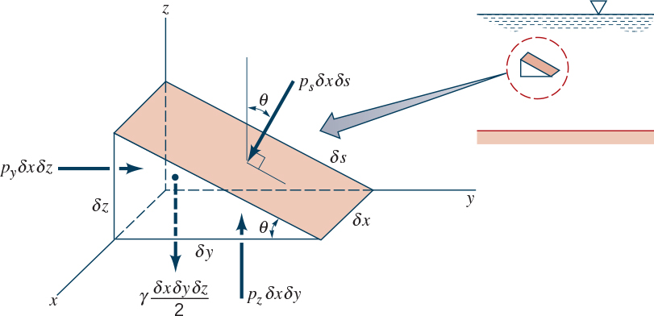
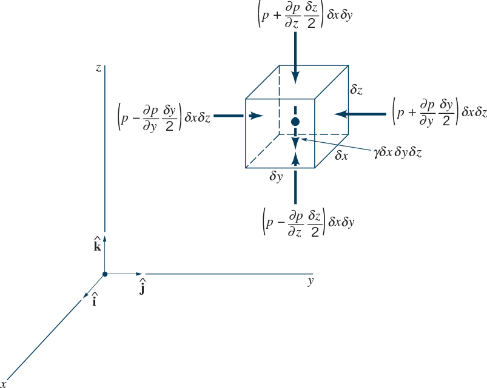
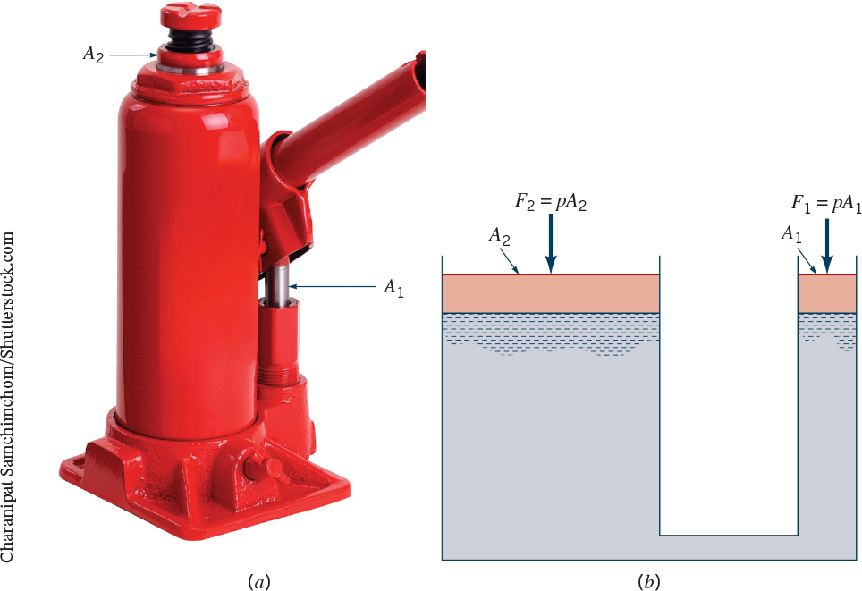
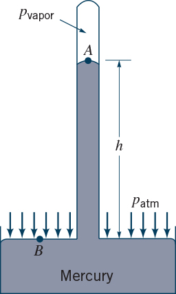
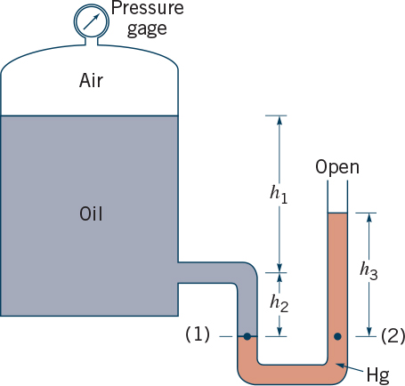
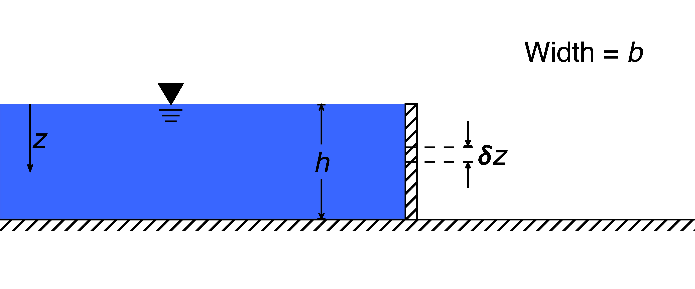
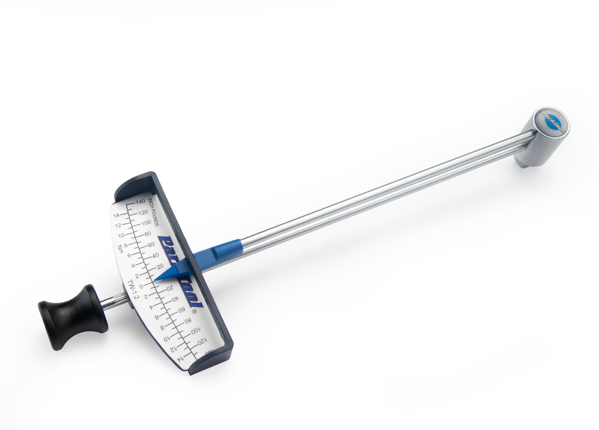
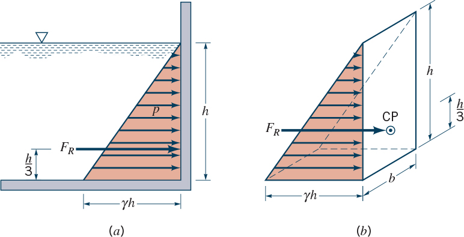
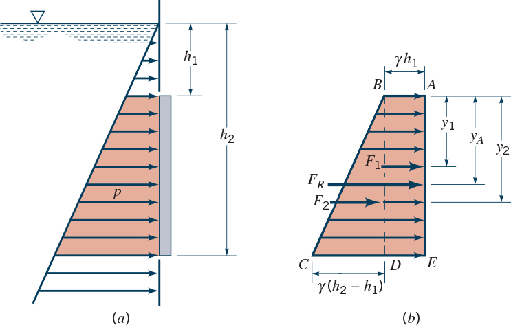

**ENVI 580: Fluid Mechanics**  
**Duquesne University**  

```{r include=FALSE}
library(ggplot2)
library(raster)
library(rgdal)
library(dplyr)
library(broom)
```

## Fluid Statics  
The key concept here is hydrostatic pressure.  In this case, hydro is in reference to any fluid, as opposed to water, as the Greek root suggests.  -static means not accelerating, or at least the resultant forces other than those from motion.

### Direction of Pressure  
Hydrostatic pressure is the pressure that you would feel if you swim to the bottom of the deep end of the swimming pool.  One important concept is that hydrostatic pressure acts in all directions equally.  To demonstrate this, we consider an arbitrary three-dimensional wedge of fluid:  

  

The sum of the forces on the wedge are (with an inelegant, but valid, $x$ direction):  
\begin{equation}
\Sigma F_x = p_x \frac{1}{2} \delta y \delta z - (p_x + \frac{\delta p_x}{\delta x} \delta x) \frac{1}{2} \delta y \delta z = 0
\end{equation}
\begin{equation}
\Sigma F_y = p_y \delta x \delta z - p_s \delta x \delta s \sin{\theta} = 0
\end{equation}  
This formulation assumes that the fluid is not accelerating.  
\begin{equation}
\Sigma F_z = p_z \delta x \delta y - p_s \delta x \delta s \cos{\theta} -\gamma \frac{\delta x \delta y \delta z}{2} = 0
\end{equation}  
Where the $x$ direction goes to $0=0$ as $\delta x \rightarrow 0$.  Geometrically, $\delta y$ and $\delta z$ can be substituted with:  
\begin{equation}
\delta y = \delta s \cos{\theta}
\end{equation}  
\begin{equation}
\delta z = \delta s \sin{\theta}
\end{equation}  
and the $y$ and $z$ directions reduce to:  
\begin{equation}
p_y - p_s = 0
\end{equation}
\begin{equation}
p_z - p_s = \frac{\gamma \delta z}{2}
\end{equation}
As $\delta x$, $\delta y$, and $\delta z$ approach zero, $p_y = p_z = p_s$.  $p_x$ will equal the other dimensions by similarity.  This shows that, at a point, pressure will be equal in all directions, including arbitrary, such as the angled surface, directions.  

If we extend our concept of hydrostatic pressure of swimming in a pool, we can understand that the increase in pressure would be felt regardless of the orientation of your ears.  

### Hydrostatic Pressure  
Before we begin with hydrostatic pressure, we should set forth two important definitions in environmental fluids, pressure reference values.  This has important implications as problems will have significantly different results if the incorrect reference is used.  

**Absolute pressure** is exactly what it sounds like, the pressure reference is zero - as in no pressure - and therefore, everything is always under some pressure.  This means that atmospheric pressure (~101,000 Pa) is taken as the pressure at the free surface.  

In contrast, **gage pressure**, is pressure with some non-zero reference, usually atmospheric pressure.  Most of the problems that we do with water are in gage pressure.  This is because the density of air is $\rho \approx 1.23\ kg/m^3$ while the density of water is $\rho \approx 10^3\ kg/m^3$.  This means any vertical change in water will correspond to a change that is *three orders of magnitude* less in air; this is likely negligible.  

  

In the z-direction, the pressure (we'll add the weight of the fluid momentarily):
\begin{equation}
\delta \Sigma F_z = (p - \frac{\delta p}{\delta z} \frac{\delta z}{2}) \delta x \delta y - (p + \frac{\delta p}{\delta z} \frac{\delta z}{2}) \delta x \delta y
\end{equation}  
which reduces, and by extension, the other directions become:  
\begin{equation}
\delta \Sigma F_z = - \frac{\delta p}{\delta z} \delta x \delta y \delta z  
\end{equation}  
\begin{equation}
\delta \Sigma F_y = - \frac{\delta p}{\delta y} \delta x \delta y \delta z  
\end{equation}  
\begin{equation}
\delta \Sigma F_x = - \frac{\delta p}{\delta x} \delta x \delta y \delta z  
\end{equation}  
which can be expressed in summation notation with unit vectors:  
\begin{equation}
\delta \Sigma F = \nabla F = - (\frac{\delta p}{\delta x} \hat{i} + \frac{\delta p}{\delta y} \hat{j} + \frac{\delta p}{\delta z} \hat{k} ) \delta x \delta y \delta z  
\end{equation}  
where $\nabla F$ is the del operator, on $F$, which indicates the gradient operator, or vector product.  Note, $\nabla \cdot$ is the divergence, or scalar product, and $\nabla \times$ is the curl of a vector.  

We can also write this in terms of pressure:  
\begin{equation}
\nabla p = - ( \frac{\delta p}{\delta x} \hat{i} + \frac{\delta p}{\delta y} \hat{j} + \frac{\delta p}{\delta z} \hat{k} )  
\end{equation}  

Let's think about fluid pressure changes in a non-accelerating fluid.  Think about the pool.  Does pressure, as felt in your ears, change as you swim along the surface?  The only change is when you swim down.  That's because the only other force is gravity (there are normal forces along the edge of the pool, but these are balanced by the pressure).  Let's consider only the $z$-direction where $\delta W$ is the differential weight of the fluid parcel, $\delta x \delta y \delta z$.  
\begin{equation}
- \delta W \hat{k} = - \gamma \hat{k} \delta x \delta y \delta z  
\end{equation}  
We then include the weight into our sum of forces, this time only in the $z$-direction:  
\begin{equation}
\Sigma \delta F \hat{k} = - \frac{\delta p}{\delta z} \hat{k} \delta x \delta y \delta z - \gamma \hat{k} \delta x \delta y \delta z  
\end{equation}  

At rest, $\Sigma F = 0$, and the resultant force balance is:  
\begin{equation}
\frac{\delta p}{\delta z} = - \gamma  
\end{equation}  

This equation can be integrated to find our standard hydrostatic pressure equation:  
\begin{equation}
\int_{p_1}^{p_2} \delta p = - \gamma \int_{z_1}^{z_2} \delta z  
\end{equation}  
Before we take this integral, we should point out that $\gamma$ is outside of the integral; this is because this formulation is only valid for incompressible fluids.  We will discuss compressibility later.  The result is:  
\begin{equation}
p_2 - p_1 = - \gamma (z_2 - z_1)  
\end{equation}  

### Static Tap  
A static tap is the most simple hydrostatic pressure measurement tool.  This is not dissimilar to a piezometer, which will be discussed later.  The easiest example of a static tap is for a water tank.  Water tanks are typically not open to the atmosphere or transparent to inspect the water level.  Instead, typically a clear tube is connected at the bottom (it can reconnect at the very top to keep detritus from falling into it, but it must be within the head space) and run up the side of the tank.  The clear tube can then be used to determine the height of the water in the tank.  

### Hydraulic Pump  
  
A hydraulic pump is a great example of pressure acting equally in all directions at any level.  A force applied over a small area will increase the pressure according to our definition of pressure $p = \frac{F_1}{A_1}$.  We now know that the pressure will only change with a change in height, and the pressure at the other side of the system will be the same.  What is different?  The areas.  Therefore, the pressure on the other side will result in a force $F_2 = p A_2$.  If we combine these equations, we can see the advantage of the hydraulic pump:  
\begin{equation}
\frac{F_1}{A_1} = \frac{F_2}{A_2}  
\end{equation}  
or, for mechanical advantage,  
\begin{equation}
\frac{F_1}{F_2} = \frac{A_1}{A_2}  
\end{equation}  
or, in other words, if the second area is big, the force on the second area will be big.  This is why the drive cylinder of a hydraulic pump is small and the load cylinder is larger.  

### Vapor Pressure and Barometers
Vapor pressure is a special characteristic of a fluid.  It is the equilibrium of molecules moving from liquid to gas phase and gas to liquid phase; in this way, it is related to the partial pressure of the gas at a given temperature.  When it is the only gas in a space, it is the given pressure itself.  In this way, it is related to the vaporization energy of a material.  The value, which is a function of temperature, gives us the way to calculate pressure using a barometer:  

  
Have you wondered why atmospheric pressure, as reported in the news, is typically reported in units of inches or millimeters of mercury?  It is because mercury was used as a barometer.  Why is this?  Does it have to do with the ability to build a reasonable sized instrument?  

From our hydrostatic pressure equation, we can write the equation for a mercury barometer:  
\begin{equation}
p_{Hg_{vapor}} - p_{atm} = - \gamma (z_2 - z_1) = - \gamma_{Hg} h  
\end{equation}  
where $h$ is the change in depth.  
\begin{equation}
p_{atm} = p_{Hg_{vapor}} + \gamma_{Hg} h  
\end{equation}  
We know $Hg_{vapor}$ and atmospheric pressure, therefore, we should be able to calculate the size of the typical mercury barometer.  

### Manometers  
#### Example 2.2  
  

#### Example 2.3  
  

#### Inclined Manometers  
Note that we only account for pressure changes with height, that is, in line with the direction of gravity.  This is independent of the perpendicular direction.  

### Pressure Along a Plane  
There are two key aspects of pressure along a plane we will address: force and torque/moment.  To do this, we will first develop the equations for a dam holding back a reservoir (Figure).  

  

#### Pressure  
\begin{equation}
p = \rho g z = \gamma z  
\end{equation}  

#### Force  
\begin{equation}
dF = p dA  
\end{equation}  
\begin{equation}
F = \int_{A} p\ dA = \int_{0}^{h} \gamma z\ b\ dz = \frac{1}{2} h \gamma\ bh  
\end{equation}  
Per the figure, $z=0$ is the free surface and $z=h$ is the solid bottom.  Note that the solution is written with the average pressure on the left and the surface area of the dam on the right.  The reduced solution is:  
\begin{equation}
F = \frac{1}{2} b \gamma h^2  
\end{equation}  

#### Moment  
Before we continue, let's remember what moment, or torque, is.  Torque is the application of a force on a rotational axis; it can be thought of as the rotational analog of force.  The units are typically $N m$ (SI) or foot-pounds (BG).  The general public may be most familiar with torque when it comes to a torque wrench to tighten a bolt or screw a precise amount.  This is required for many delicate machines parts such as bicycles (at least some of the components).  

  

With a torque wrench, we can visualize the force applied over a distance.  In the torque wrench in the figure, the greater force you apply on the bolt, the further you will push the needle over on the scale.  The equation for torque is $\tau = r \times F$, where the cross product shows us that there is a direction, which can be determined via the right-hand-rule.  It is easy to visualize along a single radius that force applied in one direction will counteract force applied in the opposite direction; however, when the forces become more complex, the right-hand-rule must be applied.  

First, let's solve the moment for the hinge at the bottom, with the solid boundary:  
\begin{equation}
M = r \times F = \int_{0}^{h} (h-z) \gamma z b\ dz  
\end{equation}  
where we use $r = h-z$ as the moment arm.  
\begin{equation}  
M = \int_{h=0}^{h} b h \gamma z\ dz - b \gamma z^2\ dz  
\end{equation}  
\begin{equation}  
M = [ \frac{\gamma b h z^2}{2} - \frac{\gamma b z^3}{3} ]^{h}_{0}  
\end{equation}  
\begin{equation}
M = \frac{\gamma g h^3}{2} - \frac{\gamma b h^3}{3} = \frac{1}{6} \gamma b h^3  
\end{equation}  

This can also be grouped such that it shows a product of the average force, $\frac{1}{2} b \gamma h^2$ and the center of force, $\frac{1}{3}h$.  Given the force, this integral proves the location of the center of force for a rectangular dam such as this.  The direction should be verified with the right-hand-rule.  Convention states that counter-clockwise, or out-of-the-page, is positive; therefore, in the previous example with the hinge on the bottom, the moment of the hydrostatic pressure on the dam wall is negative.  

Another way to determine pressure is with pressure prisms.  This results in the same formula; however, it provides a visual.

  

We can redo the moment calculation with the hinge on the top of the dam:
\begin{equation}
M = r \times F = \int_{0}^{h} z \gamma z b\ dz  
\end{equation}  
here, $z$ is the moment arm.  
\begin{equation}  
M = \int_{h=0}^{h} b \gamma z^2\ dz = \frac{1}{3} \gamma b h^3  
\end{equation}  
This can be expressed as $M = r \times p_c A$ where $p_c$ is the pressure at the center (recall this was the result from the force calculation)  
\begin{equation}  
\frac{1}{3} \gamma b h^3 = \frac{2}{3} h\ \times \frac{1}{2} \gamma h\ b h    
\end{equation}  
Recall, from the top of the dam, the moment arm will be $\frac{2}{3} h$.  

Before we work on example problems, let's consider a submerged plane.  

  

Using the pressure prism, we see that the force on this gate is the sum of two quantities: the hydrostatic pressure of the water above the gate and the hydrostatic pressure of the water adjacent to the gate.  While it is possible to reintegrate to find the resultant moment, we can also consider the total hydrostatic moment as the sum of the rectangle (water above the gate) and the triangle (water adjacent to the gate).  In this fashion, we will consider the pressure $\gamma h_1$ that acts at $F_1$, which is exactly halfway down the gate because there is no variation along the gate, and the pressure $\frac{1}{2} \gamma (h_2-h_1)$ that acts at $F_2$, which is one-third of the height of the gate from the bottom.  Incidentally, $F_R$ is the resultant force location, which is a weighted average of the two.  

Let's see how this works.  


