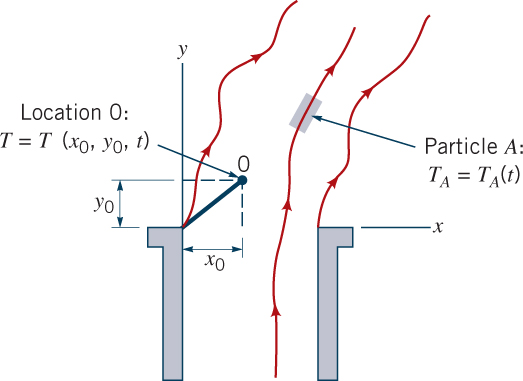
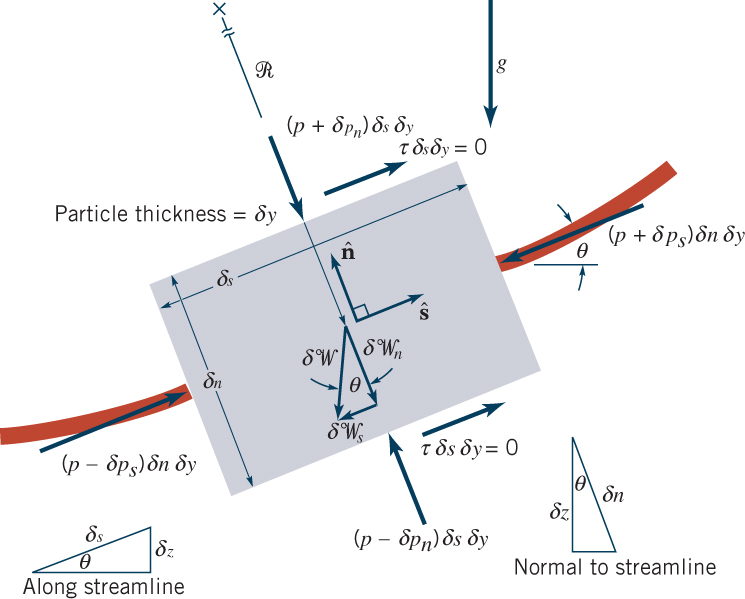
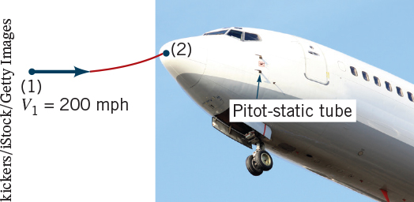

**ENVI 580: Fluid Mechanics**  
**Duquesne University**  

```{r include=FALSE}
library(ggplot2)
library(raster)
library(rgdal)
library(dplyr)
library(broom)
```

## Streamline, Pathline, and Streakline  
A **streamline** is a connected line that is everywhere tangential to the velocity field.  Sometimes, a streamtube is the name given to the small cluster of streamlines that are together; this is typically done for visualization.  

A **pathline** is the line that the path of a marked parcel of fluid takes through a domain.  From classic photographic visualization, this is the line that occurs from a small amount of dye added to a precise point in a flow at one time and the path traced out with an open camera shutter.  This requires that the flulid parcel/starting point and time be noted to identify the pathline as pathlines may diverge significantly from point to point or time to time.  

A **streakline** is a connected line made up of the position of every fluid parcel that has passed through a point from a given time.  From classic photographic visualization, this is the line that results from a dye tracer added at a precise point and continuing to emit dye as the flow continues.

In a *steady* flow ($\frac{\partial u}{\partial t} \vert_{x,y,z} = 0$), these lines coincide.  

## Point-of-View (introduced in Ch. 4)  
There are two general approaches to describe fluid motion, *Eulerian* and *Lagrangian*, both after famous mathematicians.  Both are useful in fluid mechanics and it is sometimes difficult to identify who we are using these two descriptions as you start out.  

The *Eulerian* description is fixed in space and provides the properties of a flow (e.g., pressure, velocity) as a function of time in specific places relative to a fixed reference frame.  

The *Lagrangian* description is fixed in flow and provides the properties of a flow as a record of what happens over time to a specific parcel of fluid.  This is sometimes called, 'following the flow.'  

  

## $F=ma$ along a streamline  
Newton's second law, $F = m a$, is applied here to a segment of a streamline (Figure).  We identify the segment to have mass and velocity, and we allow it to turn.  

Before we apply Newton's second law, we need to make some definitions and assumptions.  First, the coordinate system we use will be in reference to the streamline; we have two components, $s$, which is coincident with the streamline, and $n$, which is normal to the streamline.  We will also assume the flow is *steady* and *incompressible*.  Lastly, we define the motion of the flow in terms of a speed $v = \frac{ds}{dt}$ and radius of curvature $R_{(s)}$.  We find by the chain rule:  

\begin{equation}  
a_s = \frac{dv}{dt} = \frac{dv}{ds}\frac{ds}{dt} = \frac{dv}{ds} v  
\end{equation}  

and by centripetal acceleration:  

\begin{equation}  
a_n = \frac{v^2}{R}  
\end{equation}  

Therefore, the sum of the forces in each ($s$ and $n$) direction must equal $ma$, or:  $\delta m = \rho \delta{V\llap{-}}$  

  

For $s$:  
\begin{equation}  
\delta F = (p - \delta p_s) \delta n \delta y - (p + \delta p_s) \delta n \delta y - \gamma \sin \theta \delta {V\llap{-}}  
\end{equation}  
Taking the solution from the first term of the Taylor series expansion, 
\begin{equation}  
\delta p_s \approx \frac{\partial p}{\partial s} \frac{\delta s}{2}  
\end{equation}  
We get:  
\begin{equation}  
- \frac{\partial p}{\partial s} \delta {V\llap{-}} - \gamma \sin \theta \delta {V\llap{-}} = \rho \delta {V\llap{-}} \frac{dv}{ds} v  
\end{equation}  
With $\sin \theta = \frac{dz}{ds}$ and $\frac{dv}{ds} v = \frac{1}{2} \frac{dv^2}{ds}$  
\begin{equation}  
- \frac{\partial p}{\partial s} - \gamma \frac{dz}{ds} = \rho \frac{1}{2} \frac{dv^2}{ds}  
\end{equation}  
Which reduces to:  
\begin{equation}  
- d p - \gamma d z - \rho \frac{1}{2} d v^2 = 0  
\end{equation}  
and simplifies to the *Bernoulli equation*:  
\begin{equation}  
p + \frac{\rho v^2}{2} + \gamma z = 0  
\end{equation}  

## Syringe Example  

  

## The Pitot and Pitot-static tube  

  


