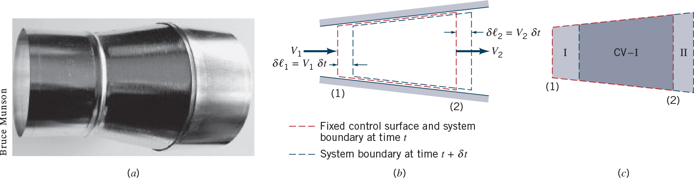
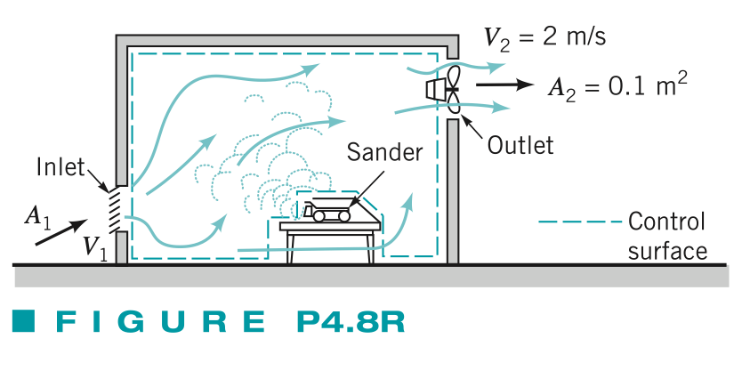
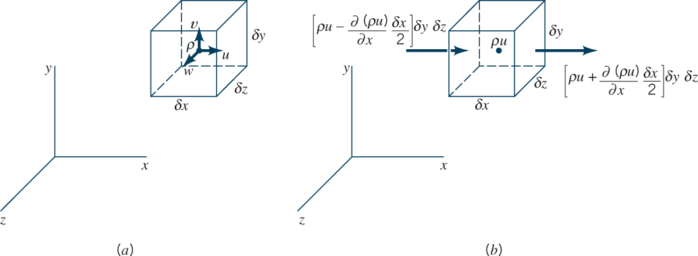
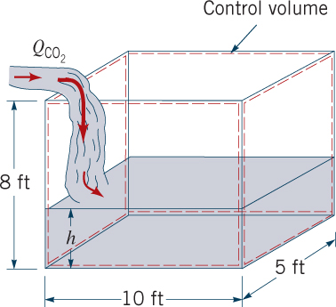
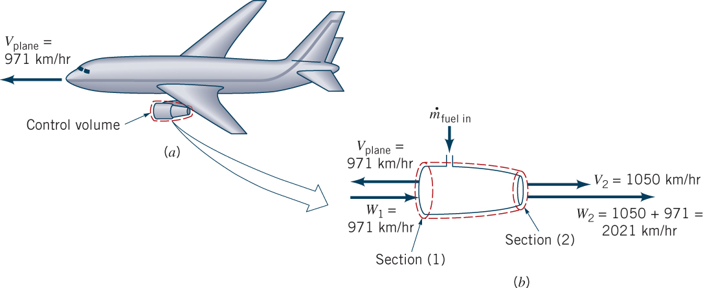
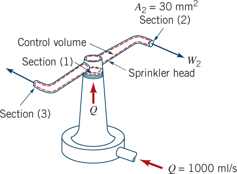

**ENVI 580: Fluid Mechanics**  
**Duquesne University**  

```{r include=FALSE}
library(ggplot2)
library(raster)
library(rgdal)
library(dplyr)
library(broom)
library(grid)
```

## Streamline, Pathline, and Streakline  
A **streamline** is a connected line that is everywhere tangential to the velocity field.  Sometimes, a streamtube is the name given to the small cluster of streamlines that are together; this is typically done for visualization.  

A **pathline** is the line that the path of a marked parcel of fluid takes through a domain.  From classic photographic visualization, this is the line that occurs from a small amount of dye added to a precise point in a flow at one time and the path traced out with an open camera shutter.  This requires that the flulid parcel/starting point and time be noted to identify the pathline as pathlines may diverge significantly from point to point or time to time.  

A **streakline** is a connected line made up of the position of every fluid parcel that has passed through a point from a given time.  From classic photographic visualization, this is the line that results from a dye tracer added at a precise point and continuing to emit dye as the flow continues.

In a *steady* flow ($\frac{\partial u}{\partial t} \vert_{x,y,z} = 0$), these lines coincide.  

## Point-of-View (introduced in Ch. 4)  
There are two general approaches to describe fluid motion, *Eulerian* and *Lagrangian*, both after famous mathematicians.  Both are useful in fluid mechanics and it is sometimes difficult to identify who we are using these two descriptions as you start out.  

The *Eulerian* description is fixed in space and provides the properties of a flow (e.g., pressure, velocity) as a function of time in specific places relative to a fixed reference frame.  

The *Lagrangian* description is fixed in flow and provides the properties of a flow as a record of what happens over time to a specific parcel of fluid.  This is sometimes called, 'following the flow.'  

  

## Steady and Unsteady/Transient Flow  
Steady flow is a flow that does not change in time.  In the Eulerian sense, the velocity may be different in different locations, but at a given location, it does not change.  That is:  

\begin{equation}  
\frac{\partial \vec{u}}{\partial t} = 0  
\end{equation}  

Transient flow, as it is more commonly referred to in computational fluid dynamics, is a flow where the velocity does change with time.  Contrary to how the book mixes unsteady and turbulent flow, transient flow refers to the mean flow, $\vec{\bar{u}}$, and therefore, you can have steady or transient turbulent flow.  This distinction is important as turbulent flow velocities do change with time, but only the deviations from the mean, $\vec{u'}$ where $u = \bar{u} + u'$ in each dimension.  

## Velocity Field  
At any point, the fluid velocity is given as $\vec{u}(x,y,z,t)$.  The acceleration is the time derivative of the velocity; although, we need to apply the chain rule to show:  

\begin{equation}  
\vec{a}(t) = \frac{d \vec{u}}{d t} = \frac{d \vec{u}}{d t} + \frac{\partial \vec{u}}{\partial x} \frac{d x}{d t} + \frac{\partial \vec{u}}{\partial y} \frac{d y}{d t} + \frac{\partial \vec{u}}{\partial z} \frac{d z}{d t}  
\end{equation}  

\begin{equation}  
\vec{a}(t) = \frac{\partial \vec{u}}{\partial t} + u \frac{\partial \vec{u}}{\partial x} + v \frac{\partial \vec{u}}{\partial y} + w \frac{\partial \vec{u}}{\partial z} = \frac{\partial}{\partial t} + (\vec{u} \cdot \nabla)  
\end{equation}  

Recall, $\vec{u} = (u \hat{i} + v \hat{j} + w \hat{k}) = (u,v,w)$.  This is the definition of the *material derivative*, also known as the fluid or substantial derivative and denoted as $\frac{D}{D t}$.  

When applied to velocity to find the acceleration, $a = \frac{D \vec{u}}{D T}$, the result is two parts.  The convective acceleration $u \frac{\partial \vec{u}}{\partial x} + v \frac{\partial \vec{u}}{\partial y} + w \frac{\partial \vec{u}}{\partial z}$, which indicates the acceleration of the fluid itself, captures the information of the fluid flow as moving around obstructions or through pipes - it does not allow for a time-dependent change in the fluid flow.  The local acceleration $\frac{\partial \vec{u}}{\partial t}$ represents the time-dependent changes in the flow; this is the unsteady term.  

```{r echo=FALSE, warning=FALSE, fig.cap="Velocity Field"}
scl <- 10 # to adjust number of points plotted
rng <- scl + 1 # to adjust range of points plotted
x <- array(NA, dim = (rng * rng))
y <- x
u <- x
v <- x
for (i in 1:rng) {
      for (j in 1:rng) {
            x[rng*(i-1)+j] <- (i-1)/scl
            y[rng*(i-1)+j] <- (j-1)/scl
            u[rng*(i-1)+j] <- x[rng*(i-1)+j]
            v[rng*(i-1)+j] <- -y[rng*(i-1)+j]
      }
}
dat <- data.frame(x,y,u,v)
sc <- 20 # scale factor for plotting arrows
ggplot(dat, aes(x=x,y=y)) +
      geom_segment(aes(xend = x+u/sc, yend = y+v/sc), arrow = arrow(length = unit(0.1, "cm")), linewidth = 0.25) +
      theme(panel.background = element_rect(fill = "white", colour = "black")) + 
      theme(aspect.ratio = 1, panel.background = element_rect(fill = "white", colour = "black")) +
      theme(axis.text = element_blank()) +
      theme(axis.title = element_text(face = "plain", size = 11))
```

Consider the fluid flow described by the two-dimensional velocity field, $\vec{u} = \frac{u_0}{\lambda} (x \hat{i} - y \hat{j})$.  The acceleration is given by:  

\begin{equation}  
\vec{a}(t) = \frac{D \vec{u}}{D t} = \frac{\partial \vec{u}}{\partial t} + u \frac{\partial \vec{u}}{\partial x} + v \frac{\partial \vec{u}}{\partial y} + w \frac{\partial \vec{u}}{\partial z}  
\end{equation}  

We begin with two-dimensional flow, by definition, has no z-direction; therefore, $\vec{u} \cdot \hat{k} = w = 0$.  Additionally, steady flow has no change in time; therefore, $\frac{\partial}{\partial t} = 0$.

\begin{equation}  
u = \vec{u} \hat{i} = \frac{u_0}{\lambda} x  
\end{equation}  

\begin{equation}  
v = \vec{u} \hat{j} = \frac{u_0}{\lambda} (-y)  
\end{equation}  

\begin{equation}  
\frac{\partial \vec{u}}{\partial x} = \frac{u_0}{\lambda} \frac{\partial}{\partial x} (x \hat{i} - y \hat{j}) = \frac{u_0}{\lambda} (\hat{i})  
\end{equation}  

\begin{equation}  
\frac{\partial \vec{u}}{\partial y} = \frac{u_0}{\lambda} \frac{\partial}{\partial y} (x \hat{i} - y \hat{j}) = \frac{u_0}{\lambda} (-\hat{j})  
\end{equation}  

Note, the result of these two partial derivatives reduces to $\frac{\partial (x \hat{i}) }{\partial x} = \hat{i}$ while $\frac{\partial (x \hat{i}) }{\partial y} = 0$.  

\begin{equation}  
\vec{a} = u \frac{\partial \vec{u}}{\partial x} + v \frac{\partial \vec{u}}{\partial y}  
\end{equation}  

\begin{equation}  
\vec{a} = \frac{u_0}{\lambda} (x) \frac{u_0}{\lambda} (\hat{i}) + \frac{u_0}{\lambda} (-y) \frac{u_0}{\lambda} (-\hat{j})  
\end{equation}  

\begin{equation}  
\vec{a} = \frac{u_{0}^{2}}{\lambda^{2}} x \hat{i} + \frac{u_{0}^{2}}{\lambda^{2}} y \hat{j}  
\end{equation}  

```{r echo=FALSE, warning=FALSE, fig.cap="Acceleration Field"}
scl <- 10 # to adjust number of points plotted
rng <- scl + 1 # to adjust range of points plotted
ax <- array(NA, dim = (rng * rng))
ay <- ax
for (i in 1:rng) {
      for (j in 1:rng) {
            ax[rng*(i-1)+j] <- x[rng*(i-1)+j]
            ay[rng*(i-1)+j] <- y[rng*(i-1)+j]
      }
}
dat <- data.frame(x,y,u,v,ax,ay)
sc <- 20 # scale factor for plotting arrows
ggplot(dat, aes(x=x,y=y)) +
      geom_segment(aes(xend = x+u/sc, yend = y+v/sc), arrow = arrow(length = unit(0.1, "cm")), linewidth = 0.25, color = "Black") +
      geom_segment(aes(xend = x+ax/sc, yend = y+ay/sc), arrow = arrow(length = unit(0.1, "cm")), linewidth = 0.25, color = "Blue") +
      theme(panel.background = element_rect(fill = "white", colour = "black")) + 
      theme(aspect.ratio = 1, panel.background = element_rect(fill = "white", colour = "black")) +
      theme(axis.text = element_blank()) +
      theme(axis.title = element_text(face = "plain", size = 11))
```

## Continuum Hypothesis  
We have been working within the continuum hypothesis all along; at this point it is useful to remind us of that hypothesis as it is referenced in the Reynolds Transport Theorem.  Assume that you want to track the molecules of a fluid (this is a different branch of fluid mechanics called kinetic theory, which is mainly theoretical, as it is computationally impossible) flow.  Each molecule is tagged and followed.  This would include far too many particles and collisions to track with any precision.  Instead, assume that the properties of a fluid flow are identical within a small discrete region and that they change continuously through the flow.  This is the continuum hypothesis.  

## Reynolds Transport Theorem  
For the Reynolds Transport Theorem, we consider a fluid property, $B$.  This can be any property of the fluid as opposed to the flow.  In the next section, we will consider the property of mass to derive the principle of continuity, or conservation of mass.  Since we will work with the differential changes in this system, we also define the property $B$ in terms of its value per mass, $B = m b$.  The concept of the theorem, as outlined in section 4.4, is that we track the differential change of the property within a control volume.  



To develop the Reynolds Transport Theorem, we reference the above schematic.  At the starting time, $t$, the system and control volume are the same (red dotted line).  In the Lagrangian frame of reference, the system moved to the right (green dotted line).  In the Eulerian frame of reference, the system moved through the control volume.  Let us define the control volume as the system at time $t$ as $B_{system}(t) = B_{cv}(t)$ and allow the system to move to the right.  Therefore, at time $t + \delta t$, the system has moved somewhat out of the control volume.  The system equation is:

\begin{equation}  
B_{system}(t + \delta t) = B_{cv}(t + \delta t) - B_{I}(t + \delta t) + B_{II}(t + \delta t)  
\end{equation}  

The first term (on the right side) allows for the property in the control volume to change, the other terms are illustrated by the change in the figure above.  We take the difference between $B_{system}(t + \delta t)$ and $B_{system}(t)$.

\begin{equation}  
\frac{\partial B_{sys}}{\partial t} \approx \frac{B_{cv}(t + \delta t) - B_{cv}(t)}{\delta t} - \frac{B_{I}(t + \delta t)}{\delta t} + \frac{B_{II}(t + \delta t)}{\delta t}  
\end{equation}  

The first term, when $\delta t \to 0$ can be written as $\frac{B_{cv}(t + \delta t) - B_{cv}(t)}{\delta t} = \frac{\partial B_{cv}}{\partial t}$.  The latter terms can be shown as the mass flow in to or our of the control volume.  Recall, $\frac{\delta B}{\delta t} = \dot{B}$ as the time-derivative of the property, $B$.  For small time changes, consider the change of $B$ is the mass flow of $m b$; however, we can cast the change in property as the change in flow, $Q = u A$.  To verify this, confirm the dimensions of the equation:  

\begin{equation}  
\lim_{\delta t \to 0} \frac{B_{II}(t + \delta t)}{\delta t} = \rho_{2} b_{2} \vec{u}_{2} \cdot A_{2}  
\end{equation}  

The $B_{I}$ result is the same.  We also draw the control volume such that the flux is perpendicular to the surface; this allows us to remove the dot product.  The result is:  

\begin{equation}  
\frac{D B_{sys}}{D t} = \frac{\partial B_{cv}}{\partial t} + \Sigma \rho_{out} A_{out} u_{out} b_{out} - \Sigma \rho_{in} A_{in} u_{in} b_{in}  
\end{equation}  

### Application  
  

Assume a sander produces $N = 10^{5}$ particles per second into a room (Figure).  The room is ventilated by a fan that draws in clean air from the left and ejects dusty air on the right.  Assume that the fan is doing its job and keeping the dust level steady.  Let's use this example to define the terms of the Reynolds Transport Theorem.  Let $N$ be the extrinsic property, number of particles.  

At steady state, $\frac{D N_{sys}}{D t} = 0$ is the governing assumption that the number of particles is held constant within the system.  At any given time, there exist a given number of particles.  Also, $\frac{\partial N_{cv}}{\partial t} = 0$ is the time rate of change of the number of particles within the control volume, which we also assume to be steady.  This comes from our assumption that the fan is doing its job.  We are left with a production and evacuation term from the control volume.  We set these equal in order to solve for the steady concentration.  First, the units, for each of the summation terms, the units are:  

\begin{equation}  
\frac{mass}{{length}^3} \frac{{length}^2}{1} \frac{length}{time} = \frac{mass}{time}  
\end{equation}  

allow the particles to be the unit of mass, such that:  

\begin{equation}  
0 = 0 + \Sigma \rho_{out} A_{out} u_{out} n_{out} - 10^5 \frac{\mathrm{particles}}{s}  
\end{equation}  

or 

\begin{equation}  
n = \frac{10^5}{(2) (0.1)} = 5 \times 10^5 \mathrm{\ particles \ per \ cubic \ meter}  
\end{equation}  

## The Continuity Equation  
The continuity equation follows from the Reynolds Transport Theorem and the conservation of mass equation (typically they are thought of as the same, as they are simply two different was to express the same concept).  Of course, we have encountered the concept of conservation of mass previously; the expression of flow is typically adjusted by cross-sectional area: $Q = V_1 A_1 = V_2 A_2$.  From the Reynolds Transport theorem, the rate of change of the extensive property in a system is:  

\begin{equation}  
\frac{D B_{sys}}{D t} = \frac{\partial B_{cv}}{\partial t} + \dot{B}_{out} - \dot{B}_{in}  
\end{equation}  

Since the property in question is mass, we see mass, $B$, must be $B = m b$, and therefore, $b = 1$.  For mass to be conserved, $\frac{D B_{sys}}{D t} = 0$.  The first form of the continuity equation involves the substitution:  

\begin{equation}
B_{cv} = \int_{cv} \rho \ d V\llap{-}  
\end{equation}  

\begin{equation}  
\frac{D B_{sys}}{D t} = \frac{\partial}{\partial t} \int_{cv} \rho \ d V\llap{-} + \dot{B}_{out} - \dot{B}_{in}  
\end{equation}  

The second form of the continuity equation takes $\dot{B}$ and expresses this as a flux across the control surface, a surface that covers the control volume:  

\begin{equation}  
\dot{B} = \int_{cs} \rho \vec{u} \cdot \hat{n} \ dA  
\end{equation}  

where $_{cs}$ is the control surface of area, $A$, and $\hat{n}$ is the normal vector to the control surface; this allows an arbitrary control volume.  Because of the normal vector, this can be applied to $\dot{B}_{in}$ and $\dot{B}_{out}$ (i.e., *in* will be negative).  

Therefore,  

\begin{equation}  
\frac{D B_{sys}}{D t} = \frac{\partial}{\partial t} \int_{cv} \rho \ d V\llap{-} + \int_{cs} \rho \vec{u} \cdot \hat{n} \ dA  
\end{equation}  

From Gauss's Theorem, the surface integral can be rewritten with a volume integral:  

\begin{equation}  
\frac{D B_{sys}}{D t} = \frac{\partial}{\partial t} \int_{cv} \rho \ d V\llap{-} + \int_{cv} \nabla \cdot (\rho \vec{u}\ d V\llap{-}  
\end{equation}  

\begin{equation}  
\frac{D B_{sys}}{D t} = \int_{cv} \frac{\partial \rho}{\partial t} + \nabla \cdot (\rho \vec{u}) \ d V\llap{-}  
\end{equation}  

\begin{equation}  
\frac{\partial \rho}{\partial t} + \nabla \cdot (\rho \vec{u}) = 0  
\end{equation}  

Which gives the form commonly applied:  

\begin{equation}  
\frac{\partial \rho}{\partial t} + \frac{\partial (\rho u)}{\partial x} + \frac{\partial (\rho v)}{\partial y} + \frac{\partial (\rho w)}{\partial z}= 0  
\end{equation}  

Furthermore, we can simplify this for steady $\frac{\partial}{\partial t} = 0$, incompressible $\rho =$ constant, and therefore can be taken outside of the differential:  

\begin{equation}  
\frac{\partial u}{\partial x} + \frac{\partial v}{\partial y} + \frac{\partial w}{\partial z}= 0  
\end{equation}  

This result can also be achieved with a differential approach where a cube control volume with an arbitrary flow $\rho \vec{u}$.  

  

Where in one dimension, we have:  

\begin{equation}  
\dot{M}_x = (\rho u + \frac{\partial (\rho u)}{\partial x} \frac{\delta x}{2}) \delta y \delta z - (\rho u - \frac{\partial (\rho u)}{\partial x} \frac{\delta x}{2}) \delta y \delta z  
\end{equation}  

\begin{equation}  
\dot{M}_x = \frac{\partial (\rho u)}{\partial x} \delta x \delta y \delta z  
\end{equation}  

In each direction, and incorporating time, we arrive at the same:  

\begin{equation}  
\frac{\partial \rho}{\partial t} + \frac{\partial (\rho u)}{\partial x} + \frac{\partial (\rho v)}{\partial y} + \frac{\partial (\rho w)}{\partial z}= 0  
\end{equation}  

## Results of the Continuity Equation  
Flow through the control surface yields this important relationship, which we have used in flow calculations before:  
\begin{equation}  
Q = A_1 \vec{u}_1 = A_2 \vec{u}_2  
\end{equation}  

## Moving Control Volume  
For a moving control volume, we must define our relative velocity:  
\begin{equation}  
\vec{u} = \vec{u}_{rel} + \vec{u}_{c. V\llap{-}}  
\end{equation}  

## Moving, Non-deforming Control Volume  
We also note this important observation of the flow in and out of the control volume: flow out of the control volume is positive; this is because the velocity, or component of velocity, is coincident with the normal vector, $\hat{n}$.  This is why we strive to draw control volumes with perpendicular flows in and out (or parallel, to avoid calculating the components).  

Finally, we find a more general integral form of conservation of mass (and the Reynolds Transport Theorem), that can be applied to example problems and useful to keep in mind for momentum next unit.  

\begin{equation}  
\frac{\partial}{\partial t} \int_{c. V\llap{-}} \rho \ d V\llap{-} + \int_{c.s.} \rho \vec(u) \cdot \hat{n} \ dA = 0  
\end{equation}  

Note that the mass flux in and out of the control surface have been subsumed into the second integral.  In fact, these were always the same thing; however, in the derivation, we separated the idea that the volume was changing, then used Gauss's theorem to actually show they are the same thing.  

## Examples  
  

  






