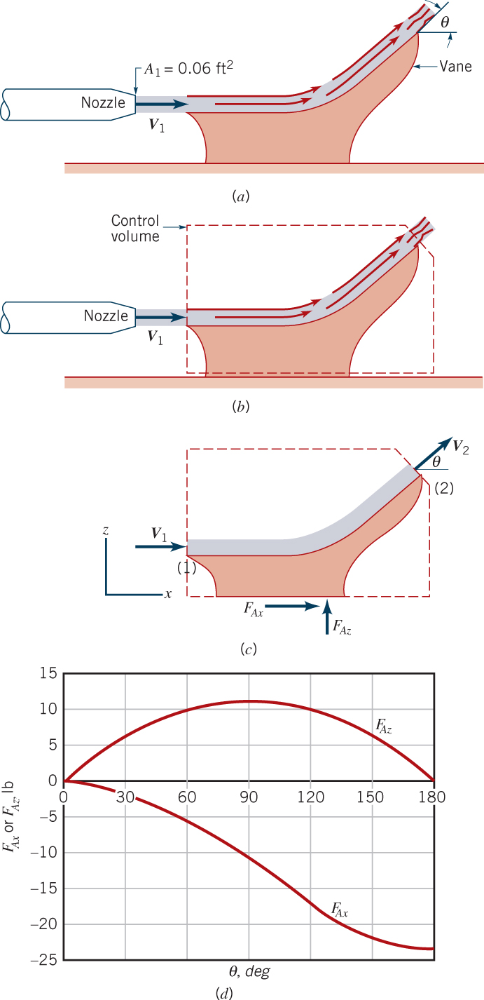
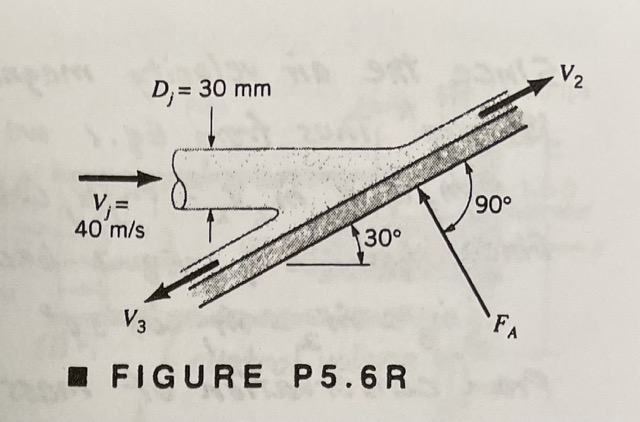

**ENVI 580: Fluid Mechanics**  
**Duquesne University**  

```{r include=FALSE}
library(ggplot2)
library(raster)
library(rgdal)
library(dplyr)
library(broom)
```

## Newton's Second Law  
From Newton's Laws, we understand that when an object, or control volume, has a net force, or sum of forces, that is nonzero, the object accelerates.  This acceleration is a change in momentum.  Therefore, we can write that the total rate of change $\frac{D}{D t}$  of momentum, which is velocity times mass, or $\int \rho \ d V\llap{-}$, or:  
\begin{equation}  
\frac{D}{D t} \int \vec{u} \rho \ d V\llap{-} = \Sigma \vec{F}  
\end{equation}  

We have already shown that the Reynolds Transport Theorem, with property, $B$ as momentum and $b$ as velocity:  
\begin{equation}  
\frac{D}{D t} \int \vec{u} \rho \ d V\llap{-} = \frac{\partial}{\partial t} \int_{cv} \vec{u} \rho \ d V\llap{-} + \int_{cs} \vec{u} \rho \vec{u} \cdot \hat{n} \ dA  
\end{equation}  

The combination of which yields:  
\begin{equation}  
\Sigma \vec{F} = \frac{\partial}{\partial t} \int_{cv} \vec{u} \rho \ d V\llap{-} + \int_{cs} \vec{u} \rho \vec{u} \cdot \hat{n} \ dA  
\end{equation}  

For a non-deforming control volume, the internal momentum is constant.  We can simplify this relationship to:  
\begin{equation}  
\Sigma \vec{F} = \Sigma \vec{u}_{\mathrm{out}} \rho_{\mathrm{out}} u_{\perp, \mathrm{out}} A_{\mathrm{out}} - \Sigma \vec{u}_{\mathrm{in}} \rho_{\mathrm{in}} u_{\perp, \mathrm{in}} A_{\mathrm{in}}  
\end{equation}  

Note that there are two velocities in each term.  One is the vector, which comes from the momentum (also a vector), and the other comes from the Reynolds Transport Theorem, where we held it to be the velocity perpindicular to the control volume.  This distinction is important for change in directions.  

## Application to a Change in Flow Direction  
  

  

