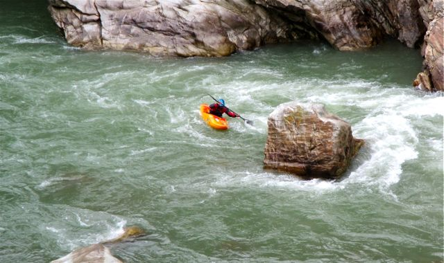
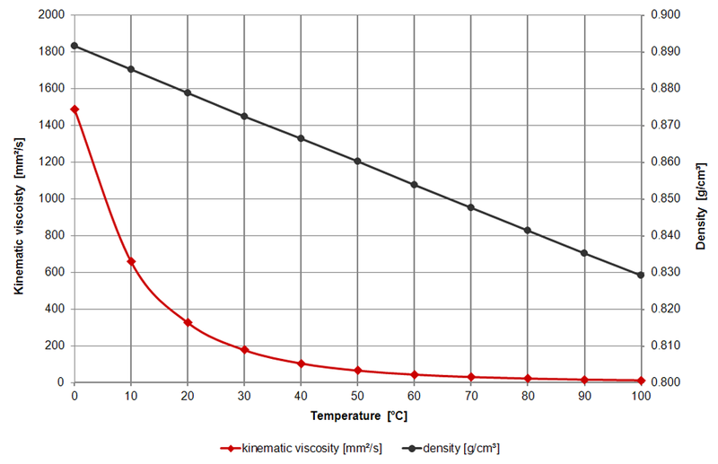

**ENVI 580: Fluid Mechanics**  
**Duquesne University**  

```{r include=FALSE}
library(ggplot2)
library(raster)
library(rgdal)
library(dplyr)
library(broom)
```

## Fluid Velocity Field and Multivariate Calculus  
The velocity field, in the Eulerian frame of reference, can be expressed:  
\begin{equation}  
\vec{u} = u \hat{i} + v \hat{j} + w \hat{k}  
\end{equation}  

where $\hat{i}$, $\hat{j}$, and $\hat{k}$ are the unit vectors and $u$, $v$, and $w$ are the velocity components in the $x$, $y$, and $z$ directions, respectively.  

Traditionally, we think of acceleration as the time derivative of velocity.  This remains true; however, because we consider the fluid field, the change in the velocity components must also be considered, therefore:  
\begin{equation}  
\vec{a} = \frac{D \vec{u}}{Dt} = \frac{\partial \vec{u}}{\partial t} + u \frac{\partial \vec{u}}{\partial x} + v \frac{\partial \vec{u}}{\partial y} + w \frac{\partial \vec{u}}{\partial z}  
\end{equation}  

Note that this results in the components taken at each $\vec{u}$; therefore, there are three equations provided here, one for $u$, $v$, and $w$.  

## Vorticity  
Eddies exist all around us.  If you canoe or kayak, you may have experienced eddies in a river as a good place to pull in and rest after a challenging rapid.  You may have also found eddies in calm parts of a river near the shore.  They occur whenever there is a separation of flow.  

  

Vorticity is rotational flow.  The vorticity, $\zeta$, is the *curl* of the velocity field:  
\begin{equation}  
\zeta = \nabla \times \vec{u} = \begin{vmatrix} \hat{i} & \hat{j} & \hat{k} \\ \frac{\partial}{\partial x} & \frac{\partial}{\partial y} & \frac{\partial}{\partial z} \\ u & v & w \end{vmatrix}  
\end{equation}  

### Vortex shedding  
Many eddies form behind obstacles in a flow.  A quintessential example of this is the flag flapping in the breeze.  This occurs because the flagpole acts as an obstacle and eddies develop behind the pole.  These eddies grow and separate (shed) in turn, which forms an oscillatory flow behind the pole that is easily visualized by the flag.  With computational fluid dynamics, we can visualize the same type of flow called a von Karman vortex street.  

  

In the case of vortex shedding, many vorticies, that is, little eddies, separate from the obsticle.  This is fine in the case of the flagpole; however, it can be damaging if it occurs on the tip of an airplane wing.  There are several modifications at the end of the airplane wing to move that oscillation away from the wing itself; namely the lifted wing tip and the a flexible rod on the trailing edge of the tip.  In fact, small guide rods usually appear along the trailing edge of the wing to safely move vorticies away from the structural components of the wing.  

  

## Continuity and Vorticity  
As an example, we consider the flow field given by:  
\begin{equation}  
\vec{u} = (x^2-y^2) \hat{i} - 2 x y \hat{j}  
\end{equation}  
Does this satisfy the continuity equation and is it irrotational?  First, incompressible continuity requires:  
\begin{equation}  
\nabla \cdot \vec{u} = 0  
\end{equation}  
\begin{equation}  
\frac{\partial u}{\partial x} + \frac{\partial v}{\partial y} + \frac{\partial w}{\partial z} = 0  
\end{equation}  
\begin{equation}  
2 x + -2x + 0 = 0  
\end{equation}  
$\therefore$ the flow field does satisfy the continuity equation.  For a flow to be irrotational, the vorticity must be zero.  
\begin{equation}  
\zeta = \begin{vmatrix} \hat{i} & \hat{j} & \hat{k} \\ \frac{\partial}{\partial x} & \frac{\partial}{\partial y} & \frac{\partial}{\partial z} \\ (x^2-y^2) & 2 x y & 0 \end{vmatrix}  
\end{equation}  
By inspection, we can see that the lack of $z$ in the flow field will cause $\frac{\partial}{\partial z}$ to be zero.  Additionally, since $w = 0$, the $\partial w$ terms will also be zero.  We have only one term, the $\hat{k}$, term left, which is:  
\begin{equation}  
\zeta = (\frac{\partial v}{\partial x} - \frac{\partial u}{\partial y}) = (-2 y) - (-2 y) = 0  
\end{equation}  

Continuity is limited in its ability to find missing components.  For example, given the y-component of a two-dimensional velocity field, find the x-component.  
\begin{equation}  
v = x^2 + 2 x y  
\end{equation}  
Since continuity must be preserved, and there is no z-component, we find that  
\begin{equation}  
\frac{\partial u}{\partial x} + \frac{\partial v}{\partial y} + = 0 = \frac{\partial u}{\partial x} + 2 x  
\end{equation}  
We can integrate the result:  
\begin{equation}  
\frac{\partial u}{\partial x} = - 2 x  
\end{equation}  
\begin{equation}  
\int{du} = - \int{2 x \ dx}  
\end{equation}  
\begin{equation}  
u = - x^2 + f(y)  
\end{equation}  
where $f$ is a function of $y$.  Unfortunately, other than it has no derivative in $x$, it cannot be determined.  

## Stream Functions  
Stream functions are a convenient consequence of the continuity equation.  For the purposes of the stream function, consider a two-dimensional flow (plane flow).  The continuity equation is:  

\begin{equation}  
\frac{\partial u}{\partial x} + \frac{\partial v}{\partial y} = 0  
\end{equation}  

There exists ($\exists$) a function, $\psi$, such that:  

\begin{equation}  
u = \frac{\partial \psi}{\partial y}  
\end{equation}  
\begin{equation}  
v = -\frac{\partial \psi}{\partial x}  
\end{equation}  

The verification that this satisfies the continuity equation is straightforward:  

\begin{equation}  
\frac{\partial}{\partial x} \frac{\partial \psi}{\partial y} + \frac{\partial}{\partial y} \frac{-\partial \psi}{\partial x} = \frac{\partial^2 \psi}{\partial x y} - \frac{\partial^2 \psi}{\partial x y} = 0  
\end{equation}  

As an example, consider the fluid flow characterized by:  

\begin{equation}  
u = 2 y  
\end{equation}  
\begin{equation}  
v = 4 x  
\end{equation}  

To find the stream function, we begin:  

\begin{equation}  
u = 2 y = \frac{\partial \psi}{\partial y}  
\end{equation}  
\begin{equation}  
\int d \psi = \int 2 y \ dy  
\end{equation}  
\begin{equation}  
\psi = y^{2} + f(x)  
\end{equation}  

At this point, nothing more can be said about the nature of the integration constant, $f(x)$; however, we can impose the condition of $v$.  

\begin{equation}  
v = 4 x = -\frac{\partial \psi}{\partial x} = -\frac{\partial}{\partial x} (y^{2} + f(x)) = -\frac{\partial f(x)}{\partial x}  
\end{equation}  
\begin{equation}  
\int df = -\int 4 x \ dx  
\end{equation}  
\begin{equation}  
f(x) = -2 x^{2} + c  
\end{equation}  

$\therefore$ $\psi = -2 x^2 + y^2 + c$.  While we do not know the value of $c$, we do know that, for the purposes of the velocity field, it is immaterial.  Here, we see another interesting consequence; it is not that we don't know the value of $c$, it is that $c$ could equal any constant... and does.  This is the stream function, as in the function that defines the streamline.  We can develop the equation for streamlines as, for a range of values of $c$:  

\begin{equation}  
y = \pm \sqrt{2 x^2 + c}  
\end{equation}  

```{r echo=FALSE, warning=FALSE, fig.cap="Stream functions for the flow field based on (27)"}
x <- (c(-300:300)) / 100 # this is provided as plus and minus, although, for this stream function, x is squared and it will not matter; however, x is provided as a +/- for general use.
cs <- 11 # total number of integration constants
y <- array(NA, dim = c(length(x),cs))

for (i in 1:cs) {
      c <- i - 6 # adjust the index to the constant, c.  note: i must be positive
      y[,i] <- (2 * x^2 + c)^(1/2)
}

G <- data.frame(x,y)
ggplot(G) +
      geom_line(aes(x=x,y=X1)) +
      geom_line(aes(x=x,y=-X1)) + # provided as the minus for the +/-
      geom_line(aes(x=x,y=X2)) +
      geom_line(aes(x=x,y=-X2)) +
      geom_line(aes(x=x,y=X3)) +
      geom_line(aes(x=x,y=-X3)) +
      geom_line(aes(x=x,y=X4)) +
      geom_line(aes(x=x,y=-X4)) +
      geom_line(aes(x=x,y=X5)) +
      geom_line(aes(x=x,y=-X5)) +
      geom_line(aes(x=x,y=X6)) +
      geom_line(aes(x=x,y=-X6)) +
      geom_line(aes(x=x,y=X7)) +
      geom_line(aes(x=x,y=-X7)) +
      geom_line(aes(x=x,y=X8)) +
      geom_line(aes(x=x,y=-X8)) +
      geom_line(aes(x=x,y=X9)) +
      geom_line(aes(x=x,y=-X9)) +
      geom_line(aes(x=x,y=X10)) +
      geom_line(aes(x=x,y=-X10)) +
      geom_line(aes(x=x,y=X11)) +
      geom_line(aes(x=x,y=-X11)) +
      labs(x = "x", y = "y") +
      xlim(c(-3,3)) +
      ylim(c(-3,3)) +
      theme(panel.background = element_rect(fill = "white", colour = "black")) +
      theme(aspect.ratio = 1) +
      theme(axis.text = element_text(face = "plain", size = 12))

```

## Euler's Equations of Invicid Motion  
The formal derivation of Euler's Equations appear in the textbook.  The basic sketch of the derivation starts with Newton's second law, $\Sigma F = m a$.  For a differential mass, we use density multiplied by the substantial derivative defined at the start of this section.  For the sum of the forces, we have weight (gravity) and the normal forces as a consequence of pressure.  This list neglects viscous, or in practical terms, shear forces.  The result is Euler's equations (assuming gravity is only in the downward z-direction):  

\begin{equation}  
- \frac{\partial p}{\partial x} = \rho (\frac{\partial u}{\partial t} + u \frac{\partial u}{\partial x} + v \frac{\partial u}{\partial y} + w \frac{\partial u}{\partial z})  
\end{equation}  
\begin{equation}  
- \frac{\partial p}{\partial y} = \rho (\frac{\partial v}{\partial t} + u \frac{\partial v}{\partial x} + v \frac{\partial v}{\partial y} + w \frac{\partial v}{\partial z})  
\end{equation}  
\begin{equation}  
\rho g - \frac{\partial p}{\partial z} = \rho (\frac{\partial w}{\partial t} + u \frac{\partial w}{\partial x} + v \frac{\partial w}{\partial y} + w \frac{\partial w}{\partial z})  
\end{equation}  

## Bernoulli's Equation  
Bernoulli's equation was developed based on Newton's second law and it is logical that we could develop the same relationship from Euler's equations.  Especially since the conditions are the same (or can be made the same): steady, incompressible, invicid.  We start with the vector form of Euler's equations and apply the vector identity below.  At the same time, we will write the $\vec{g}$ as $\vec{g} = -g \nabla z$ where $g$ is the magnitude of the acceleration due to gravity.  

\begin{equation}  
-\rho g \nabla z - \nabla p = \rho (\vec{u} \cdot \nabla) \vec{u}  
\end{equation}  
\begin{equation}  
(\vec{u} \cdot \nabla) \vec{u} = \frac{1}{2} \nabla (\vec{u} \cdot \vec{u}) - \vec{u} \times (\nabla \times \vec{u})  
\end{equation}  

This replacement yields:  
\begin{equation}  
-\rho g \nabla z - \nabla p = \frac{\rho}{2} \nabla (\vec{u} \cdot \vec{u}) - \vec{u} \times (\nabla \times \vec{u})  
\end{equation}  

Which we rearrange to:  
\begin{equation}  
\frac{\nabla p}{\rho} \frac{1}{2} \nabla (u^2) + g \nabla z = \vec{u} \times (\nabla \times \vec{u})  
\end{equation}  

We now take the entire above equation and apply the dot product with $\cdot ds$, the differential section of a streamline.  Recall, a vector dot (scalar) product with another vector, even an operator such as $\nabla$, is the projection of the of one to the other; therefore, many of the $\nabla \cdot ds$ terms reduce to simply the change in the original quantity, for example: $\nabla p \cdot ds = dp$ along the streamline.  Furthermore, we note that the cross (vector) product results in a vector that is perpendicular to the components.  Since, on the right-hand-side, the components are velocity, and we are working along the streamline (i.e., tangential to the velocity), the dot product of the cross product with $ds$ is zero.  Therefore:  
\begin{equation}  
\frac{dp}{\rho} \frac{1}{2} d(u^2) + g dz = 0  
\end{equation}  

Integrated, this yields the constant on the right-hand-side that we recall from earlier.  We can take this analysis one step further and remove the condition that we take the dot product with $\cdot ds$.  Instead, we consider the right-hand-side and note that this includes a term $\nabla \times \vec{u}$; however, we know that the definition of irrotational flow is that $\nabla \times \vec{u} = 0$; therefore, we can apply the result (i.e., Bernoulli's equation) to any irrotational flow (in addition to the original restrictions).  

## Viscous Flow  
For Euler's equations, we immediately neglected the viscous or shear stresses on a fluid parcel.  It should be noted here that stress is considered a two-dimensional tensor.  A quick explanation: a zero-order tensor is a scalar, which has a magnitude and no direction; a first-order tensor is a vector, which has magnitude and direction, or magnitudes in the component directions; a second-order tensor has two direction components.  This can be visualized if we consider a cube fluid parcel.  Each face is identified by the normal vector.  Much as before, we note that the normal forces are in the normal direction, which are also noted as $\sigma_{ii}$ for the $\sigma_{xx}$, $\sigma_{yy}$, and $\sigma_{zz}$ components.  These shear stresses form a diagonal along a two-dimensional matrix (all tensors can be expressed as matrices).

  

\begin{equation}  
\sigma = \begin{bmatrix} \sigma_{xx} & \sigma_{yx} & \sigma_{zx} \\ \sigma_{xy} & \sigma_{yy} & \sigma_{zy} \\ \sigma_{xz} & \sigma_{yz} & \sigma_{zz} \end{bmatrix}  
\end{equation}  

With viscosity, the change in velocity contributes to the normal stresses (note, in the textbook, normal stresses are denoted $\sigma$ and shear stresses are denoted $\tau$; however, in general tensor notation, this is not a logical notation, as above.  When they are presented as a tensor, the $\sigma$ will be used for all stresses, but in their decomposed form, the $\tau$ will be used for shear to match the text).  We have:  

\begin{equation}  
\sigma = \begin{bmatrix} -p+2 \mu \frac{\partial u}{\partial x} & \mu (\frac{\partial u}{\partial y} + \frac{\partial v}{\partial x}) & \mu (\frac{\partial w}{\partial x} + \frac{\partial u}{\partial z}) \\ \mu (\frac{\partial u}{\partial y} + \frac{\partial v}{\partial x}) & -p+2 \mu \frac{\partial v}{\partial y} & \mu (\frac{\partial v}{\partial z} + \frac{\partial w}{\partial y}) \\ \mu (\frac{\partial w}{\partial x} + \frac{\partial u}{\partial z}) & \mu (\frac{\partial v}{\partial z} + \frac{\partial w}{\partial y}) & -p+2 \mu \frac{\partial w}{\partial z} \end{bmatrix}  
\end{equation}  

where $\mu$ is the dynamic viscosity.  Observe that the tensor is symmetric along the diagonal and the diagonal stresses are the normal stresses.  Also, this fluid flow must be constant viscosity (likely constant temperature and mixture) and therefore a Newtonian fluid.  

This inclusion means that we have to add terms to the net forces included in our consideration of Newton's second law.  Instead of Euler's equations, we get the Navier-Stokes equations:  

\begin{equation}  
\rho (\frac{\partial u}{\partial t} + u \frac{\partial u}{\partial x} + v \frac{\partial u}{\partial y} + w \frac{\partial u}{\partial z}) = - \frac{\partial p}{\partial x} + \mu (\frac{\partial^2 u}{\partial x^2} + \frac{\partial^2 u}{\partial y^2} + \frac{\partial^2 u}{\partial z^2})  
\end{equation}  
\begin{equation}  
\rho (\frac{\partial v}{\partial t} + u \frac{\partial v}{\partial x} + v \frac{\partial v}{\partial y} + w \frac{\partial v}{\partial z}) = - \frac{\partial p}{\partial y} + \mu (\frac{\partial^2 v}{\partial x^2} + \frac{\partial^2 v}{\partial y^2} + \frac{\partial^2 v}{\partial z^2})  
\end{equation}  
\begin{equation}  
\rho (\frac{\partial w}{\partial t} + u \frac{\partial w}{\partial x} + v \frac{\partial w}{\partial y} + w \frac{\partial w}{\partial z}) = - \frac{\partial p}{\partial z} - \rho g + \mu (\frac{\partial^2 w}{\partial x^2} + \frac{\partial^2 w}{\partial y^2} + \frac{\partial^2 w}{\partial z^2})  
\end{equation}  

These are the partial differential equations that describe incompressible, Newtonian fluid flow, combined with continuity.  They can be used directly (as with computational fluid dynamics or CFD, or solvers called direct numerical simulation); however, they do not have a general analytic solution (especially in turbulence, this is called the closure problem) due to their nonlinearity.  As with all nonlinear dynamic systems, this does not mean that they are not useful - quite the contrary.  They are very useful, you just have to know how to limit the problem so that you can solve them.  

### Viscosity of Motor Oil  
Everyone who drives a car (and takes care of it) encounters viscosity; specifically, the viscosity of motor oil.  This will begin to change as electric cars become more popular, but for now, we all know about viscosity even if we don't realize it.  

Like any fluid, the viscosity of oil is the resistance to flow.  If you imagine the inside of an internal combustion engine, a low viscosity fluid will have less resistance.  This is preferable for performance as it will allow the parts to move faster.  This is represented by the numbers on the oil: the smaller the number, the lower the viscosity and the easier it is to coat the internal machinery.  Typically, this is represented by one or two numbers with the first number followed by a "W", which many people think of as *winter* but really just refers to the starting conditions of the engine.  The colder it is, the more important a lower number (especially the first number) is.  You may ask, why do you need a higher viscosity if lower is better?  There are several reasons that mostly relate to keeping the material as a lubricant and preventing break-down.  The chemical and mechanical engineers who develop oil consider a range of factors and the oil is made with both different viscosities and additives to achieve the correct characteristics.  The higher/second number refers to the viscosity when the engine is at operating temperatures.  For engine oil, the ambient temperature reference is shown in the figure.

  

Viscosity is a function of temperature.  We can vizualize this best if we think about honey or molases, but for motor oil (SAE 30), the relationship is seen in the figure.  

  

### Flow between parallel plates  
Let us consider the incompressible, steady, Newtonian, flow between two infinite parallel plates.  This is the best time to formally introduce the no-slip boundary condition; this means that on the boundary, fluid does not *slip*.  The easiest example is at a stationary wall, the fluid does not move at the wall.  Even $\delta x$ away from the wall, the flow can be nonzero, but at the wall, it is zero.  We also don't allow fluid to move through a solid boundary; however, in this case, we're going to say that flow is only in the $x$-direction, so $v=w=0$.

First, we apply the continuity equation with our velocity limitations of $v=w=0$:  
\begin{equation}  
\frac{\partial u}{\partial x} + 0 + 0 = 0  
\end{equation}  
$\therefore \frac{\partial u}{\partial x} = 0$.  This gives the new Navier-Stokes equations as (assume the planes are in the $x-y$ plane and $z$ is up, which separates the planes):  
\begin{equation}  
0 = - \frac{\partial p}{\partial x} + \mu (\frac{\partial^2 u}{\partial z^2})  
\end{equation}  
\begin{equation}  
0 = - \frac{\partial p}{\partial z} - \rho g  
\end{equation}  

There is no motion in the $y$-direction; therefore, we will omit that component from our analysis.  

The $z$-component equation can be separated and integrated to yield:  
\begin{equation}  
p = \rho g z + f(x)  
\end{equation}  

The $x$-component can also be separated and integrated twice:  
\begin{equation}  
\mu (\frac{\partial^2 u}{\partial z^2}) = \frac{\partial p}{\partial x}  
\end{equation}  
\begin{equation}  
\frac{d^2 u}{d z^2} = \frac{1}{\mu} (\frac{\partial p}{\partial x})  
\end{equation}  
\begin{equation}  
\frac{d u}{d z} = (\frac{1}{\mu} (\frac{\partial p}{\partial x})) z + c_1  
\end{equation}  
\begin{equation}  
u = (\frac{1}{2 \mu} (\frac{\partial p}{\partial x})) z^2 + c_1 z + c_2  
\end{equation}  

Usually, we apply the boundary conditions:  
- no-slip: the velocity is zero relative to the wall at the wall  
- no-flux: there is no flow normal to the wall  

We apply this to the parallel plates:  
- Fixed, $u = 0$ at the walls  
- Moving-plate, $u = 0$ at fixed wall, $u = U_{wall}$ for the moving wall  

We also apply this to pipe flow in polar/cylindrical coordinates:  
\begin{equation}  
0 = - \frac{\partial p}{\partial z} + \mu (\frac{1}{r} \frac{\partial}{\partial r} ( r \frac{\partial u_z}{\partial r})  
\end{equation}  
which integrates and becomes:  
\begin{equation}  
u_z = - \frac{1}{4 \mu} + (\frac{\partial p}{\partial z}) (r^2 - R^2)  
\end{equation}  
where $R$ is the radius of the pipe.  

```{r echo=FALSE, warning=FALSE, fig.cap="Velocity profile in a horizontal pipe"}
r <- (c(0:10)) / 10 # radius, assume pipe radius is 1
mu <- 1.12e-3 # dynamic viscosity
dp <- -4e-3 # dp/dz pressure gradient
w <- (dp/(4*mu)) * (r^2 - 1)
vel <- data.frame(r,w)

ggplot(vel) +
      geom_line(aes(x=w,y=r)) +
      geom_line(aes(x=w,y=-r)) + # provided as the minus for the +/-
      labs(x = "u", y = "r") +
      xlim(c(0,1)) +
      ylim(c(-1,1)) +
      theme(panel.background = element_rect(fill = "white", colour = "black")) +
      theme(aspect.ratio = 1) +
      theme(axis.text = element_text(face = "plain", size = 12))

```


