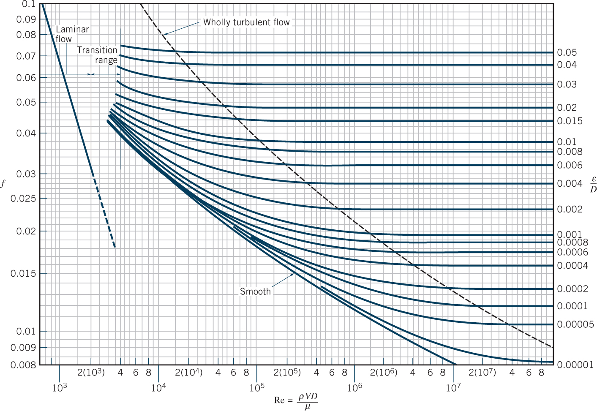
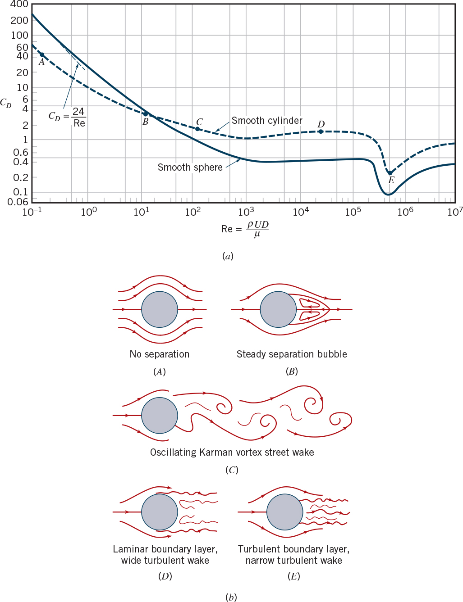

**ENVI 580: Fluid Mechanics**  
**Duquesne University**  

```{r include=FALSE}
library(ggplot2)
library(raster)
library(rgdal)
library(dplyr)
library(broom)
```

## Pipe Flow  
### Major Losses  
For the most systems, the friction loss in the pipes themselves are responsible for the energy loss of flow in a pipe.  We will primarily consider flow in a circular pipe.  We will consider minor losses soon.  Let's consider the dimensional analysis of the pressure drop, which dictates flow, as:  

\begin{equation}  
\Delta p = \phi (u, D, \ell, \varepsilon, \mu, \rho)  
\end{equation}  

where $\Delta p$ is the pressure drop along the pipe of length, $\ell$, $u$ is the average velocity, $D$ is the diameter of the pipe, $\varepsilon$ is the roughness height, $\mu$ is the dynamic viscosity, and $\rho$ is the fluid density.  Since there are seven variables expressed in three dimensions, there are four dimensionless terms.  By inspection, we find:  

\begin{equation}  
\Pi_1 = \frac{\Delta p}{\frac{1}{2} \rho u^2}  
\end{equation}  
\begin{equation}  
\Pi_2 = \frac{\rho u D}{\mu} = \mathrm{Re}  
\end{equation}  
\begin{equation}  
\Pi_3 = \frac{\ell}{D}  
\end{equation}  
\begin{equation}  
\Pi_4 = \frac{\varepsilon}{D}  
\end{equation}  

Note that there is one constant in $\Pi_1$ that is from the historic development of this relationship.  These terms can be rearranged to form:  

\begin{equation}  
\frac{\Delta p}{\frac{1}{2} \rho u^2} = \frac{\ell}{D} \phi(\mathrm{Re}, \frac{\varepsilon}{D})  
\end{equation}  

The value, $f$ is defined as the friction factor, which is a function of $\mathrm{Re}$ and $\frac{\varepsilon}{D}$, and for practical purposes is found with the Moody Diagram.  The remaining terms can be rearranged:  

\begin{equation}  
\Delta p = f \frac{\ell}{D} \frac{\rho u^2}{2}  
\end{equation}  

This pressure drop is convenient as it can be added to Bernoulli's equation to determine the major losses, also called *head losses* as in *hydraulic head*.  Recall Bernoulli's equation:  

\begin{equation}  
\frac{p_1}{\gamma} + \frac{u_1^2}{2 g} + z_1 = \frac{p_2}{\gamma} + \frac{u_2^2}{2 g} + z_2 + h_L  
\end{equation}  

where $h_L$ is the head loss.  Major losses can be approximated in terms of Bernoulli's equation as (divide the pressure drop by $\gamma$):  

\begin{equation}  
h_L = f \frac{\ell}{D} \frac{u^2}{2 g}  
\end{equation}  

  

## Flow over Immersed Bodies  
Dimensional analysis can yield two results here: viscous-dominated flow, or Stokes flow, or density-driven flow.

  


