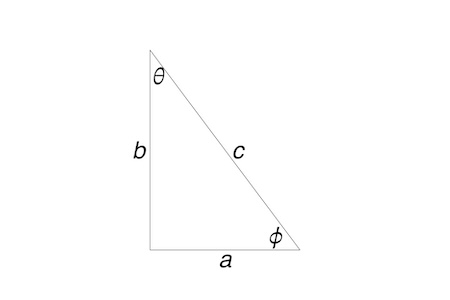

**ENVI 580: Fluid Mechanics**  
**Duquesne University**  

```{r include=FALSE}
library(ggplot2)
library(raster)
library(rgdal)
library(dplyr)
library(broom)
```

## Relationships  
  
Note, $\angle ab = 90^o$

\begin{equation}
\sin \theta = \cos \phi = \frac{a}{c}  
\end{equation}
\begin{equation}
\cos \theta = \sin \phi = \frac{b}{c}  
\end{equation}
\begin{equation}
\tan \theta = \frac{a}{b}  
\end{equation}
\begin{equation}
\tan \phi = \frac{b}{a}  
\end{equation}
\begin{equation}
\tan \theta = \frac{\sin \theta}{\cos \theta}  
\end{equation}

## Equations  
\begin{equation}
p = \rho g h = \gamma h  
\end{equation}
\begin{equation}
F_{surface} = \sigma 2 \pi r \cos \alpha  
\end{equation}
*assuming a circular conduit of radius $r$.*  
\begin{equation}
\tau = \mu \frac{d u}{d y}  
\end{equation}
\begin{equation}
F_{bouyant} = \rho_{surrounding fluid}\ g V\llap{-}  
\end{equation}
\begin{equation}
\frac{p_1}{\gamma} + \frac{v_1^2}{2 g} + z_1 = \frac{p_2}{\gamma} + \frac{v_2^2}{2 g} + z_2  
\end{equation}

