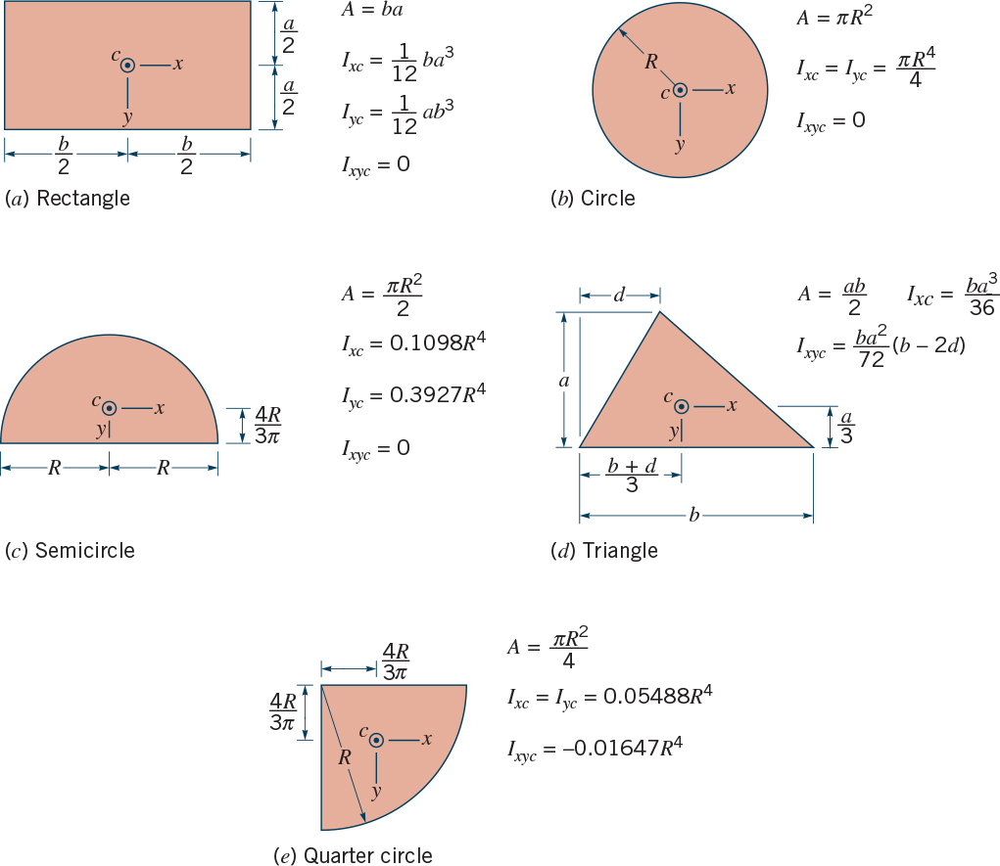

**ENVI 580: Fluid Mechanics**  
**Duquesne University**  

```{r include=FALSE}
library(ggplot2)
library(raster)
library(rgdal)
library(dplyr)
library(broom)
```
## Pressure on Submerged Surfaces  
We have explored how to calculate pressure, resultant forces, and resultant moments/torques on submerged surfaces.  In this lab, you will test your calculations in a real tank.  If you are successful, you will keep the room dry; otherwise, you will make a big mess.  For vertical surfaces, you may wish to use an integral or pressure prisms; for horizontal surfaces, the integral is trivial; for inclined surfaces, you will likely use figure 18 to avoid very messy integrals.  Remember, the *y* components are taken in-line with the surface.  



## Lab Write-up  
Your write-up for this exercise will be an annotated drawing and calculations for the surfaces.  A portion of your grade will be based on the successful calculations.  


