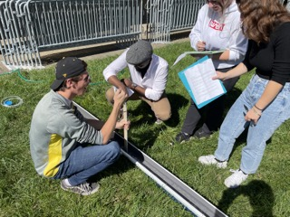

**ENVI 580: Fluid Mechanics**  
**Duquesne University**  

```{r include=FALSE}
library(ggplot2)
library(raster)
library(rgdal)
library(dplyr)
library(broom)
```

In this lab we will explore open-channel flow (e.g,. similar to canals or rivers) and the *hydraulic jump*.  To fully explore the hydraulic jump, we will use Bernoulli's equation and the concept of critical flow.  Specifically, you will investigate two flow regimes: the energy changes between them and the flow threshold that defines critical flow.  

  

## The Hydraulic Jump  
Hydraulic jumps are all around us.  We will notice them when we turn on the faucet and water sprays along the sink bowl.  In order for the flow to return, it must transition to away from an inertial flow (i.e., from the velocity of the faucet) to a gravity flow (i.e., down the drain).

## Bernoulli's Equation and the Energy Line  
Recall Bernoulli's equation and note that it is related to conservation of energy along a streamline.  The assumptions in the derivation were that the flow is invicid.  
\begin{equation}  
\frac{p}{\gamma} + \frac{v^2}{2 g} + z =   
\end{equation}  

The above equation (one side) gives the value of the *energy line*.  If we consider the static components of the energy line:  
\begin{equation}  
\frac{p}{\gamma} + z =   
\end{equation}  

We get the *hydraulic grade line*.  Immediatly, we note that the difference between these two quanities is the velocity.  

## Critical Flow  
To define critical flow, we must first talk about how waves form on the surface of water.  In fact, we will explore wave celerity more in dimensional analysis and other parts of this course, but for now, wave celerity is:  
\begin{equation}  
c = \sqrt{g h}   
\end{equation}  

where $h$ is the depth of the flow.  Since this is the velocity of a wave, it would make sense to compare this to the velocity of the flow.  In fact, the Froude number is the threshold of critical flow: the flow that does not allow waves (i.e., information) to propegate upstream.  
\begin{equation}  
\mathrm{Fr} = \frac{\bar{u}}{\sqrt{g h}}  
\end{equation}  

If the Froude number is greater than unity ($\mathrm{Fr} \geq 1$), the flow is considered *supercritical*.  Otherwise, the flow is *subcritical*.  

## Pitot Tube  
In this experiment, we will use a Pitot tube to measure the energy grade line.  Note that this is different from the Pitot-static tube, as there is no static tap to compare the pressure and height.  Thus, it measures the entirety of (1).  The reference pressure is atmospheric pressure, so, like many problems we do, this is all in gage pressures.  

## Lab Write-up  
You will turn in a complete evaluation of the two flow regimes (Reynolds number, Froude number, and E.L. and H.G.L.) in an annotated figure of the experimental setup.  Note the change in all three of these values and comment on the application of the invicid assumption and the energy conservation in flow.  

